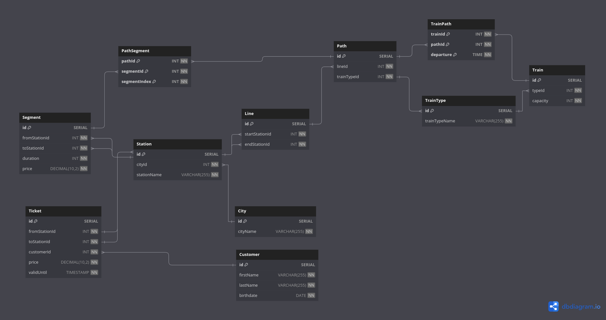

# RRS: Les Routes du Rail Suisse

<p align="center">
  
</p>

## Description de la Base de Données

Ce projet décrit une base de données relationnelle conçue pour gérer les routes ferroviaires en Suisse. Voici les principaux composants :

- **Segment** : Représente une portion spécifique d'une ligne entre deux stations.
- **Station** : Les gares où les passagers peuvent monter ou descendre.
- **Line** : Définit les lignes ferroviaires connectant deux stations de départ et d'arrivée.
- **Path** : Parcours spécifique d'un train incluant plusieurs segments.
- **Train** : Informations sur les trains, incluant leur type et leur capacité.
- **TrainType** : Catégorie d'un train (par exemple, train régional, intercity).
- **Ticket** : Billets émis aux clients pour voyager entre deux stations.
- **Customer** : Informations sur les passagers.
- **City** : Les villes où se situent les gares.

Notre schéma respecte les règles de la troisième forme normale (3NF). Toutes les colonnes non-clé dépendent uniquement de la clé primaire, et il n'y a ni redondance ni dépendance transitive.

### Relations circulaires
1. Relation entre `Segment`, `Station` et `Line`
    - Table `Segment` :
      - `fromStationId` et `toStationId` sont des clés étrangères qui pointent vers la table `Station`.
    - Table `Line`:
      - `startStationId` et `endStationId` sont des clés étrangères qui pointent vers la table `Station`.
    - Les tables `Line` et`Segment` sont aussi reliées par `Path` et `PathSegment`

2. Relation entre `Path`, `Train`, et `TrainType`
    - Table `Path` : fait référence à la table `TrainType`.
    - Table `Train` : fait référence à la table `TrainType`.
    - Table `TrainPath` : lie `Path` et `Train`.

Gestion des relations circulaires:
| Relation | Action recommandée |
|----------|:------------------:|
| `Segment` → `Station` | `ON DELETE CASCADE` |
| `Line` → `Station` |  `ON DELETE CASCADE` |
| `PathSegment` → `Path` | `ON DELETE CASCADE` |
| `TrainPath` → `Path` et `Train` | `ON DELETE CASCADE / SET NULL` |

## Prérequis
Avant d'installer et d'exécuter ce projet, assurez-vous d'avoir :

- **PostgreSQL** installé
- (Optionnel) **git** pour cloner le dépôt

## Installation
1. **Clonez le dépôt** :
   ```bash
   git clone https://github.com/LordBaryhobal/rdb-micro-project.git
   cd rdb-micro-project
   ```
2. **Créez la base de données** :
   ```sql
   CREATE DATABASE rrs_rail_suisse;
   ```
3. **Importez le schéma SQL** :
    ```bash
    psql -U utilisateur -d rrs_rail_suisse -f schema.sql
    ```
4. **Importez les données** :
    ```bash
    psql -U utilisateur -d rrs_rail_suisse -f data.sql
    ```
5. **Testez les requêtes**

## Requêtes
Voici différentes requêtes qui pourraient être utilisées pour récupérer des informations intéressantes.

### Horaire de gare
Cette requête listes les départs depuis une gare donnée

<details>
<summary>Montrer / Cacher</summary>

```sql
SELECT tp.departure + pi.timeOffset AS departure,
       tt.trainTypeName AS trainType,
       s.stationName AS terminus
FROM (
  SELECT p.id, SUM(s2.duration) * '1 minute'::INTERVAL AS timeOffset
  FROM Station AS st
  JOIN Segment AS s1 ON s1.fromStationId=st.id
  JOIN PathSegment AS ps1 ON ps1.segmentId=s1.id
  JOIN Path AS p ON p.id=ps1.pathId
  JOIN PathSegment AS ps2 ON ps1.pathId=p.id
  JOIN Segment AS s2 ON s2.id=ps2.segmentId
  WHERE st.id=8  -- Replace with desired station
    AND ps2.segmentIndex < ps1.segmentIndex
  GROUP BY p.id
) AS pi
JOIN Path as p ON p.id=pi.id
JOIN Line AS l ON l.id=p.lineId
JOIN Station AS s ON s.id=l.endStationId
JOIN TrainPath AS tp ON tp.pathId=p.id
JOIN Train AS t ON t.id=tp.trainId
JOIN TrainType AS tt ON tt.id=t.typeId;
```

<details>
<summary><b>Explications</b></summary>

**Récupération des informations sur les chemins:**
1. Récupère tous les segments partant de la gare (`s1`)
2. Joint les chemins dont il fait partie (→ `ps1` → `p`)
3. Joint tous les segments du chemin situé avant la gare (→ `ps2` → `s2` + `WHERE ps2.segmentIndex < ps1.segmentIndex`)
4. Calcule le temps de trajet avant la gare (`SUM(s2.duration) ...`)

**Formatage des informations:**
1. Récupère les informations précédentes
2. Joint les lignes correspondantes pour trouver la gare terminus (→ `l` → `s`)
3. Joint les trains correspondants pour trouver le type de train (→ `tp` → `t` → `tt`)
4. Calcule l'heure de départ en aditionnant le temps de trajet avant la gare et l'heure de départ de la ligne
</details>
</details>

### Passagers dépenciers
Cette requête liste les clients ayant acheté des tickets plus cher qu'un montant donné

<details>
<summary>Montrer / Cacher</summary>

```sql
SELECT DISTINCT 
    c.firstName,
    c.lastName,
    t.price
FROM Customer c
JOIN Ticket t ON c.id = t.customerId
WHERE t.price > 30.00  -- Replace with desired price
ORDER BY t.price DESC;
```
</details>

### Prix moyen entre deux villes
Cette requête liste le prix moyen des tickets entre deux villes

<details>
<summary>Montrer / Cacher</summary>

```sql
SELECT 
    c1.cityName as from_city,
    c2.cityName as to_city,
    ROUND(AVG(t.price), 2) as avg_ticket_price
FROM Ticket t
JOIN Station s1 ON t.fromStationId = s1.id
JOIN Station s2 ON t.toStationId = s2.id
JOIN City c1 ON s1.cityId = c1.id
JOIN City c2 ON s2.cityId = c2.id
GROUP BY c1.cityName, c2.cityName;
```
</details>

### Trajets populaires
Cette requête liste les 10 trajets les plus populaires (entre 2 gares) par nombre de tickets vendus

<details>
<summary>Montrer / Cacher</summary>

```sql
SELECT 
    s1.stationName as from_station,
    s2.stationName as to_station,
    COUNT(*) as ticket_count
FROM Ticket t
JOIN Station s1 ON t.fromStationId = s1.id
JOIN Station s2 ON t.toStationId = s2.id
GROUP BY s1.stationName, s2.stationName
ORDER BY ticket_count DESC
LIMIT 10;
```
</details>

### Passagers entre 2 gares à une date donnée
Cette requête compte le nombre de passagers ayant acheté un ticket reliant deux gares données à pour une date spécifique. À cause des limitations de notre modèle actuel, cette requête ne prend pas en compte les passagers passant entre ces deux gares sans qu'elles soient leurs point de départ, respectivement d'arrivée.

<details>
<summary>Montrer / Cacher</summary>

```sql
SELECT 
    COUNT(DISTINCT t.customerId) as total_passengers,
    s_from.stationName as from_station,
    s_to.stationName as to_station
FROM Ticket t
LEFT JOIN Station s_from ON t.fromStationId = s_from.id
LEFT JOIN Station s_to ON t.toStationId = s_to.id
WHERE '2024-12-31'::DATE BETWEEN DATE(t.validUntil) - INTERVAL '1 day'
                             AND DATE(t.validUntil)  -- Replace with your date
  AND t.fromStationId = 1  -- departure station
  AND t.toStationId = 3    -- arrival station
GROUP BY s_from.stationName, s_to.stationName;
```
</details>

### Trains en circulation à une heure donnée
Cette requête compte le nombre de trains en circulations à une heure données (par type de train).

<details>
<summary>Montrer / Cacher</summary>

```sql
SELECT COUNT(*) AS trains, tt.trainTypeName
FROM Train AS t
JOIN TrainType AS tt ON tt.id=t.typeId
JOIN TrainPath AS tp ON tp.trainId=t.id
JOIN (
    SELECT p.id, SUM(s.duration) AS duration
    FROM Path AS p
    JOIN PathSegment AS ps ON ps.pathId=p.id
    JOIN Segment AS s ON s.id=ps.segmentId
    GROUP BY p.id
) AS temp ON temp.id=tp.pathId
WHERE '09:00:00' BETWEEN tp.departure AND tp.departure + (temp.duration * '1 minute'::INTERVAL)
GROUP BY tt.id;
```
</details>

## Améliorations futures
- Ajouter une table **Schedule** pour gérer les horaires des trains.
- Implémenter des contraintes pour éviter les chevauchements de segments.
- Ajouter une table **Reservation** pour permettre la réservation de places spécifiques dans un train.
- Intégrer un système d'authentification pour les clients.